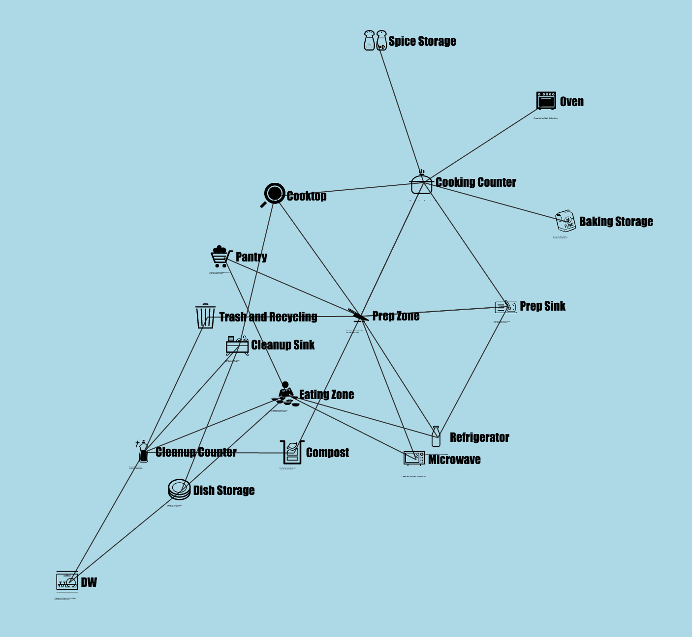

D3 Force-directed-graph of kitchen work zones.

## References

* http://ths.gardenweb.com/discussions/2767031/kitchen-work-zones-what-are-they
* http://bl.ocks.org/mbostock/950642  -- the example
* https://github.com/mbostock/d3/wiki/Force-Layout
* https://thenounproject.com/ -- icons source

## Motivation

Inspiration also came from "House O" in Rubeshibe, Japan, designed by
Jun Igarashi. I original saw it in Domus 931 from Dec 2009. There 
are different interpretations of the design, but what struck me
was how it looked like a 3d house unfolded into two dimensions, such
that you could see the connections between the pieces. It highlights
the connections and the proportions. You can see some photos [here](http://ideasgn.com/architecture/house-o-hokkaido-jun-igarashi
-architects/) or [here](http://www.e-architect.co.uk/japan/house-o-hokkaido), although what is really more interesting is 
[the floor plan at the bottom of this article](http://arqa.com/english-es-es/architecture-es/house-o-in-hokkaido-japan.html).

